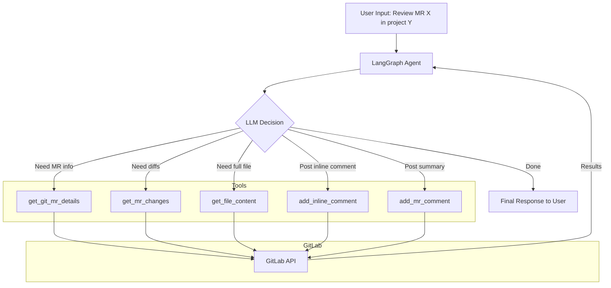

# GitLab AI Code Review Agent

An AI-powered code review agent that automatically reviews GitLab Merge Requests and posts feedback as inline comments and summary notes.

Built with [LangGraph](https://github.com/langchain-ai/langgraph) and OpenAI GPT-4o.

## Features

- Fetches MR details and file diffs from GitLab
- Retrieves full file context when diffs are insufficient
- Reviews code for bugs, performance, security, and CI/CD risks
- Posts inline comments on specific lines of changed files
- Posts a general summary comment on the MR
- Masks sensitive data (tokens, passwords) when reading files

## Architecture



The agent uses a simple graph with two nodes:
- `call` — invokes the LLM with tools bound
- `tools` — executes tool calls and returns results

The LLM decides which tools to call and when to stop.

## Tools

| Tool | Description |
|------|-------------|
| `get_git_mr_details` | Fetch MR metadata and diff_refs |
| `get_mr_changes` | Fetch file diffs for an MR |
| `get_file_content` | Retrieve full file content from a branch |
| `add_mr_comment` | Post a general comment on an MR |
| `add_inline_comment` | Post an inline comment on a specific line |

## Setup

1. Clone the repo:
   ```bash
   git clone https://github.com/sumitbit2005/gitlab-AI-Agent.git
   cd gitlab-AI-Agent
   ```

2. Install dependencies:
   ```bash
   pip install langchain-core langchain-openai langgraph python-dotenv requests httpx
   ```

3. Create a `.env` file (see `.env.example`):
   ```
   GITLAB_URL=https://your-gitlab-instance.com
   GITLAB_TOKEN=your-gitlab-personal-access-token
   OPENAI_API_KEY=your-openai-api-key
   ```

4. Run the agent:
   ```bash
   python main.py
   ```

5. Enter a prompt like:
   ```
   Review MR 42 in project mygroup/myrepo
   ```

## Configuration

All configuration is loaded from environment variables via `.env`:

| Variable | Description |
|----------|-------------|
| `GITLAB_URL` | Your GitLab instance URL |
| `GITLAB_TOKEN` | GitLab personal access token with API scope |
| `OPENAI_API_KEY` | OpenAI API key |

## SSL / Proxy

If you're behind a corporate proxy (e.g., xyz), the agent uses `httpx.Client(verify=False)` for the OpenAI connection. For production, replace with your CA bundle path.

## Project Structure

```
├── main.py              # Entry point, builds and runs the agent graph
├── config.py            # Loads environment variables
├── graph/
│   ├── nodes.py         # LLM node, tool routing, system prompt
│   └── state.py         # Agent state definition
├── tools/
│   ├── git_mr_details.py      # Fetch MR details
│   ├── get_mr_changes.py      # Fetch MR diffs
│   ├── get_file_content.py    # Fetch file content
│   ├── get_add_mr_comment.py  # Post general MR comment
│   └── add_inline_comment.py  # Post inline code comment
├── .env.example         # Template for environment variables
└── .gitignore
```

